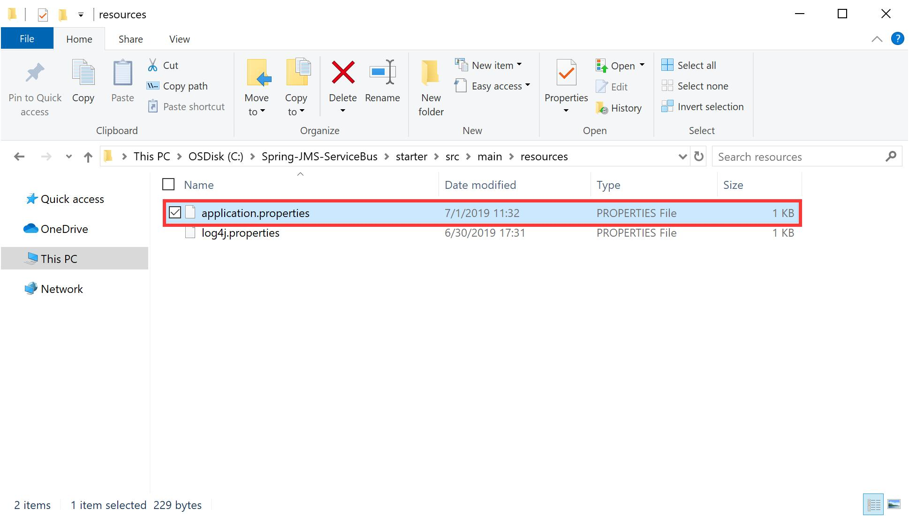

# Getting Started: Spring Messaging with Azure Service Bus Topics

Azure supports applications written in a variety of languages, one of which is Java. [Azure Servce Bus](https://spring.io/guides/gs/messaging-jms/) is its asynchronous messaging platform. Because it is based on the [AMQP 1.0](http://www.amqp.org/) standard, Service Bus can be used across the range of supported Azure platforms.

You can see the [document](https://docs.microsoft.com/azure/service-bus-messaging/service-bus-java-how-to-use-jms-api-amqp) describing how to use Service Bus resources via the Java Message Service (JMS) specification. However, many Java applications use [Spring](https://spring.io/) as their application framework and Spring JMS as a convenient template for the messaing boilerplate code.

In this tutorial, you learn how to use JMS with Spring to send messages to and receive messages from a [Azure Servce Bus](https://spring.io/guides/gs/messaging-jms/) topic in your own Java application.

## Prerequisites

The following prerequisites are required in order to follow the steps in this tutorial:

1. An Azure subscription. To complete this tutorial, you need an Azure account. You can activate your [MSDN subscriber benefits](https://azure.microsoft.com/pricing/member-offers/credit-for-visual-studio-subscribers/?WT.mc_id=A85619ABF) or sign up for a [free account](https://azure.microsoft.com/free/?WT.mc_id=A85619ABF).

2. A supported Java Development Kit (JDK), version [1.8](https://www.oracle.com/technetwork/java/javase/downloads/index.html) or later is recommended. For more information about the JDKs available for use when developing on Azure, see <https://aka.ms/azure-jdks.>

3. Apache's [Maven](http://maven.apache.org/), version 3.2 or later.

<span id="Createtopic">

## Create a Service Bus topic

</span>

In your Azure subscription, you can follow [Quickstart: Use the Azure portal to create a Service Bus topic and subscriptions to the topic](https://docs.microsoft.com/azure/service-bus-messaging/service-bus-quickstart-topics-subscriptions-portal#next-steps) to create a topic and a subscription.

a. Read the quick **overview** of Service Bus **topics**.

b. Create a Service Bus **namespace**.

c. Get the **connection string**.

d. Create a Service Bus **topic**.

e. Create a **subscription** to the **topic**

In this tutorial, the namespace is named `"testsbusns"`, the topic is named `"testtopic"` and the subscription is named `"mysubscription"`. In your own application, you can configure your namespace, topic and subscription as you prefer.

> **Note**
>>
> The Service Bus namespace must:
>>
> &emsp;*a. allow access from all networks*
>>
> &emsp;*b. be Premium or higher (lower tiers have some limitations)*
>>
> &emsp;*c. have an access policy with read/write access for your topic*

[^_^]: ## Create a Spring Boot application

[^_^]: You can create a custom application using the [Spring Initializr](https://start.spring.io/). Note that Spring Boot is not specifically needed to use Spring JMS and there are many non-Boot Spring applications that use Spring JMS. However, it is exceptionally easy to start using Spring Boot. Between Spring Boot and Spring JMS, there is very little code to write. Spring Boot, Spring JMS and the Qpid JMS client are doing most of the work. Therefore, in this guide, a simple Spring Boot application is used.

## Configure your Spring Boot application to use the Azure Service Bus Starter

1. After creating your Spring Boot application,  locate the `pom.xml` file in the directory of your app; for example:

    `C:\Spring-JMS-ServiceBus\starter\pom.xml`

    -or-

    `/users/example/home/starter/pom.xml`

    

2. Open the `pom.xml` file in a text editor and add the following lines to list of `<dependencies>`:

    ```xml
    <dependency>
        <groupId>com.microsoft.azure</groupId>
        <artifactId>azure-servicebus</artifactId>
        <version>1.2.12</version>
    </dependency>
    ```

    

3. Verify that the Spring Boot version is the version that you chose when you created your application with the Spring Initializr; for example:

    ```xml
    <parent>
        <groupId>org.springframework.boot</groupId>
        <artifactId>spring-boot-starter-parent</artifactId>
        <version>2.1.6.RELEASE</version>
    </parent>
    ```

## Configure your Spring Boot application to use Spring JMS

Spring provides a JMS integration framework that simplifies the use of the JMS API much like Spring's integration does for the JDBC API. For more information about Spring Messaging, visit <https://docs.spring.io/spring-framework/docs/current/spring-framework-reference/integration.html#jms>.

1. Locate the `pom.xml` file in the directory of your app; for example:

    `C:\Spring-JMS-ServiceBus\starter\pom.xml`

    -or-

    `/users/example/home/starter/pom.xml`

    

2. Open the `pom.xml` file in a text editor and add the following lines to list of `<dependencies>`:

    ```xml
    <dependency>
        <groupId>org.springframework</groupId>
        <artifactId>spring-jms</artifactId>
        <version>5.1.8.RELEASE</version>
    </dependency>
    ```

    

## Configure your Spring Boot application to use Qpid JMS Client

The [Apache Qpid Project](https://qpid.apache.org/) provides libraries that support the AMQP 1.0 protocol across a variety of languages. In this tutorial, we'll be using Maven to retrieve the Qpid JMS Client, which will bring in all the necessary dependencies. The Qpid client is recommended for interacting with Service Bus. For information about the latest version of the Apache Qpid JMS AMQP 1.0 client library, visit <https://qpid.apache.org/download.html>.

1. Locate the `pom.xml` file in the directory of your app; for example:

    `C:\Spring-JMS-ServiceBus\starter\pom.xml`

    -or-

    `/users/example/home/starter/pom.xml`

    

2. Open the `pom.xml` file in a text editor and add the following lines to list of `<dependencies>`:

    ```xml
    <dependency>
        <groupId>org.apache.qpid</groupId>
        <artifactId>qpid-jms-client</artifactId>
        <version>0.43.0</version>
    </dependency>
    ```

    

## Create a POJO

In this tutorial, let's create a very simply POJO that embodies the details of an email message. Pay note, we aren’t sending an email message. We’re simply sending the details from one place to another about WHAT to send in a message. The POJO is defined in:

`src/main/java/example/Email.java`

The example code is shown as follows.

```java
package example;

import java.io.Serializable;

// Add Serializable
public class Email implements Serializable {

    // Serializer ID
    private static final long serialVersionUID = -295422703255886286L;

    private String to;
    private String body;

    public Email() {
    }

    public Email(String to, String body) {
        this.to = to;
        this.body = body;
    }

    public String getTo() {
        return to;
    }

    public void setTo(String to) {
        this.to = to;
    }

    public String getBody() {
        return body;
    }

    public void setBody(String body) {
        this.body = body;
    }

    @Override
    public String toString() {
        return String.format("Email{to=%s, body=%s}", getTo(), getBody());
    }

}
```

This POJO is quite simple, containing two fields, to and body, along with the presumed set of getters and setters. Note that we must implement `Serializable` in order to use the send methods in `JmsTempalte` in Spring framework.

## Define and configure Connection Factory

Spring Boot recommends that the definition and configuration of Spring Beans to be in the code itself. While it still supports Spring Configuration files as well, this tutorial adopts the programmatic approach. In order to distinguish the applicaion code and the configuration code better, the `MessagingConfig` class is defined. The following code shows how to define and configure a `ConnectionFactory` in the `MessagingConfig` class.

`src/main/java/example/config/MessagingConfig.java`

```java
package example.config;

import com.microsoft.azure.servicebus.primitives.ConnectionStringBuilder;
import org.apache.qpid.jms.JmsConnectionFactory;
import org.springframework.beans.factory.annotation.Value;
import org.springframework.context.annotation.Bean;
import org.springframework.context.annotation.Configuration;
import org.springframework.jms.connection.CachingConnectionFactory;
import javax.jms.ConnectionFactory;

@Configuration
public class MessagingConfig {

    @Value("${azure.servicebus.connection-string}")
    private String connectionString;

    @Value("${spring.application.name}")
    private String clientId;

    @Bean
    public ConnectionFactory jmsConnectionFactory() {
        ConnectionStringBuilder csb = new ConnectionStringBuilder(connectionString);
        String remoteUri = String.format("amqps://%s?amqp.idleTimeout=3600000", csb.getEndpoint().getHost());
        JmsConnectionFactory jmsConnectionFactory = new JmsConnectionFactory(remoteUri);
        jmsConnectionFactory.setRemoteURI(remoteUri);
        jmsConnectionFactory.setClientID(clientId);
        jmsConnectionFactory.setUsername(csb.getSasKeyName());
        jmsConnectionFactory.setPassword(csb.getSasKey());
        return new CachingConnectionFactory(jmsConnectionFactory);
    }
    ...
}
```

The `@Configuration` annotation defines this class as one that defined Spring configuration. The above code defines a Spring Bean that contains an instance of the `javax.jms.ConnectionFactory` interface. The `JmsConnectionFactory` is a class provided by the Qpid JMS Client library, *i.e.*, `org.apache.qpid.jms.JmsConnectionFactory`.

The connection string is a key value to connect your application with Service Bus. The client id is required in order to consume messages off of topics. You can configure your connection string and client id in a separate `application.properties` file as follows.

1. Create an `application.properties` file in your application `resources` folder.

    

2. Open the file and add below property with your Service Bus connection string. For information about how to get a connection string, visit [Create a Service Bus topic](#Createtopic).

    ```properties
    azure.servicebus.connection-string=Endpoint=<myEndpoint>;SharedAccessKeyName=<mySharedAccessKeyName>;SharedAccessKey=<mySharedAccessKey>
    spring.application.name=<myClientName>
    ```

The `@Value` annotation is a Spring's way of retrieving configuration for the application. It will pull most of this out of a text file named `application.properties`. In `MessagingConfig` class, the `azure.servicebus.connection-string` you configured is assigned to the variable `connectionString`. The `connectionString` will then pass into the constructor of `ConnectionFactory` and the `ConnectionStringBuilder` which is built in `azure-servicebus` starter will parse your connection string.

It seems that the default timeout value defined by the Qpid Client is not good enough for the Service Bus namespace. In order to connection the application with Service Bus, in this tutorial, the query parameter `?amqp.idleTimeout=3600000` to the url is added in order to get a successful login.

## Send messages to a topic

JMS Topics is different with JMS Queues. Simply put, in AMQP-speak, there are exchanges (and one type of exchange is a Topic exchange), and clients wishing to consume messages from the exchange create a Queue and bind that Queue to the Exchange. The client then listens for messages on that Queue. Publishing messages to Topics is exactly what you would do with other JMS brokers. It works exactly the same as publishing messages to queues. In this tutorial, an instance of the `JmsTemplate` class is used to send messages.

To begin with, the `MessagingConfig` class that defined the `ConnectionFactory` also defines a `JmsTemplate` instance, which will be available as a Spring Bean. All it needs is a reference to a JMS ConnectionFactory. With the Spring auto-wiring, the `ConnectionFactory` will be passed into this method and injected into the `JmsTemplate` Spring Bean. The following code shows how to configure `JmsTemplate` in the `MessagingConfig` class based on `jmsConnectionFactory` that you have configured.

`src/main/java/example/config/MessagingConfig.java`

```java
package example.config;

import org.springframework.context.annotation.Bean;
import org.springframework.context.annotation.Configuration;
import org.springframework.jms.core.JmsTemplate;
import javax.jms.ConnectionFactory;

@Configuration
public class MessagingConfig {
    ...
    @Bean
    public JmsTemplate jmsTemplate(ConnectionFactory jmsConnectionFactory) {
        JmsTemplate returnValue = new JmsTemplate();
        returnValue.setConnectionFactory(jmsConnectionFactory);
        return returnValue;
    }
    ...
}
```

Now that an instance of `JmsTemplate` is available for injection as s Spring Bean, the main class named `Application` will use that `JmsTemplate` instance to send messages for a Topic that was created through your portal.

```java
import org.slf4j.Logger;
import org.slf4j.LoggerFactory;
import org.springframework.boot.SpringApplication;
import org.springframework.boot.autoconfigure.SpringBootApplication;
import org.springframework.context.ConfigurableApplicationContext;
import org.springframework.jms.annotation.EnableJms;
import org.springframework.jms.core.JmsTemplate;

@SpringBootApplication
@EnableJms
public class Application {

    // Number of messages to send
    private static int totalSend = 10;
    // log4j logger
    private static final Logger logger = LoggerFactory.getLogger(Application.class);

    public static void main(String[] args) {
        // Launch the application
        ConfigurableApplicationContext context = SpringApplication.run(Application.class, args);

        JmsTemplate jmsTemplate = context.getBean(JmsTemplate.class);

        logger.info("Sending message");

        // Send messages with a POJO
        for (int i = 0; i < totalSend; i++) {
            System.out.printf("Sending message %d.\n", i + 1);
            // Replace "testtopic" with your own topic name configured in your Service Bus namespace
            jmsTemplate.convertAndSend("testtopic", new Email("info@example.com", "Hello"));
        }
    }
}
```

`@SpringBootApplication` is a convenience annotation that adds all of the following:

- `@Configuration` tags the class as a source of bean definitions for the application context.

- `@EnableAutoConfiguration` tells Spring Boot to start adding beans based on classpath settings, other beans, and various property settings.

- Normally you would add `@EnableWebMvc` for a Spring MVC app, but Spring Boot adds it automatically when it sees **spring-webmvc** on the classpath. This flags the application as a web application and activates key behaviors such as setting up a `DispatcherServlet`.

- `@ComponentScan` tells Spring to look for other components, configurations, and services in the hello package, allowing it to find the controllers.

The `main()` method uses Spring Boot's `SpringApplication.run()` method to launch an application. `getBean()` method is defined in `ApplicationContext` to retreive the initialized `Bean` in the Spring container.

In this sample code, messages are sent with the POJO in a `for` loop. For each time, the application use `jmsTemplate` to send an `Email` POJO. Since our POJO is `Serializable`, the message will be converted automatically.

> **Note**
>
> Service Bus topics support a maximum message size of 256 KB in the [Standard tier](https://docs.microsoft.com/en-us/azure/service-bus-messaging/service-bus-premium-messaging) and 1 MB in the [Premium tier](https://docs.microsoft.com/en-us/azure/service-bus-messaging/service-bus-premium-messaging). The header, which includes the standard and custom application properties, can have a maximum size of 64 KB. There is no limit on the number of messages held in a topic but there is a cap on the total size of the messages held by a topic. This topic size is defined at creation time, with an upper limit of 1 GB.

## Receive messages from a subscription

For consuming messages from Topics, the key point is to create a *durable subscriber*, passing in a subscription name to the appropriate method. This subscription name is vital in order to consume messages from the Topic. The Subscription name forms the basis for a queue that will receive messages that are published to the Topic.

Essentially, what this means is that each potential consumer of messages against the Topic should have a distinct subscription name.  And, these subscription names will need to be defined for the Topic in Service Bus. In this tutorial, as shown in [Create a Service Bus topic](#Createtopic), the Topic `"testtopic"` has a single Subscription called `"mysubscription"`.

In order to receive messages from a Subscription using Java-based configuration, Spring has the [`JmsListener`](https://docs.spring.io/spring/docs/current/spring-framework-reference/integration.html#jms) annotation. The `JmsListener` annotation allows you to define a method that will be called when a message is received. The method must be defined so that the message will be passed into it.

Applications that use the `JmsListener` annotation must provide a `JmsListenerContainerFactory` which will provide the components that listen to the queue and, when a message is received, pass the message onto the annotated method. In this tutorial, the `MessagingConfig` class defines `topicJmsListenerContainerFactory` in which a *durable subscription* is created. The following code shows how to configure `topicJmsListenerContainerFactory` in the `MessagingConfig` class.

`src/main/java/example/config/MessagingConfig.java`

```java
package example.config;

import org.springframework.context.annotation.Bean;
import org.springframework.context.annotation.Configuration;
import org.springframework.jms.config.DefaultJmsListenerContainerFactory;
import org.springframework.jms.config.JmsListenerContainerFactory;
import javax.jms.ConnectionFactory;

@Configuration
public class MessagingConfig {
    ...
    @Bean
    public JmsListenerContainerFactory topicJmsListenerContainerFactory(ConnectionFactory connectionFactory) {
        DefaultJmsListenerContainerFactory returnValue = new DefaultJmsListenerContainerFactory();
        returnValue.setConnectionFactory(connectionFactory);
        returnValue.setSubscriptionDurable(Boolean.TRUE);
        return returnValue;
    }
}
```

Now that the `topicJmsListenerContainerFactory` is defined as a Spring Bean, methods can be annotated to receive messages. Here, you can define a message receiver:

`src/main/java/example/Receiver.java`

```java
package example;

import org.slf4j.Logger;
import org.slf4j.LoggerFactory;
import org.springframework.jms.annotation.JmsListener;
import org.springframework.stereotype.Component;

@Component
public class Receiver {

    // log4j logger
    private final Logger logger = LoggerFactory.getLogger(Receiver.class);

    // Replace "testtopic" with your own topic name configured in your Service Bus namespace
    @JmsListener(destination = "testtopic", containerFactory = "topicJmsListenerContainerFactory", subscription = "mysubscription")
    public void receiveTopicMessage(Email email) {
        logger.info("Receiving message from topic: {}", email);
        System.out.println("Received <" + email + ">");
    }
}
```

`Receiver` is also known as a **message driven POJO**. As you can see in the code above, there is no need to implement any particular interface or for the method to have any particular name. Besides, the method may have a [very flexible signature](https://docs.spring.io/spring/docs/current/spring-framework-reference/#jms-annotated-method-signature). Note in particular that this class has no import on the JMS API.

As with queues, the `JmsListener` annotation defines the name of the `Destination` (*i.e*, the name of the topic) that this method should listen to and the name of the `Subscription` as it has been defined in your portal. The very last important item is reflected in the named `containerFactory` value to the annotation.  When a `containerFactory` value is not supplied, Spring will find the default containerFactory. Therefore, remember to define the reference to the `topicJmsListenerContainerFactory` to use to create the underlying message listener container. The `receiveMessage()` method receives messages from the subscription and print logs on the screen.
